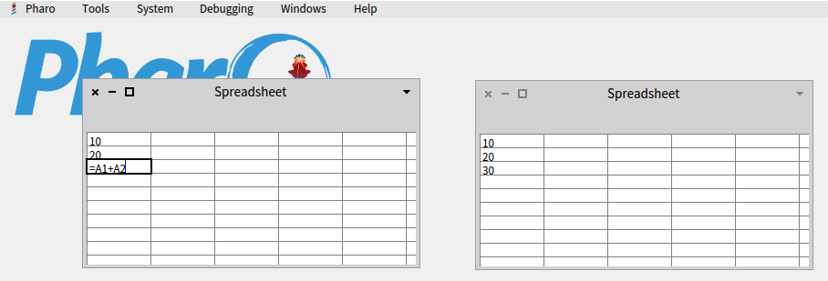

# Pharo-Spreadsheet
Spreadsheet functionality for Pharo based on Morphic




## Quick Start

```Smalltalk
Metacello new
   baseline:'Spreadsheet';
   repository: 'github://pharo-contributions/Pharo-Spreadsheet:master/src';
   load
```

and then run 

```Smalltalk
SpreadsheetMorph new openInWindow
```

or 

```Smalltalk
SpreadsheetGridMorph example
```
